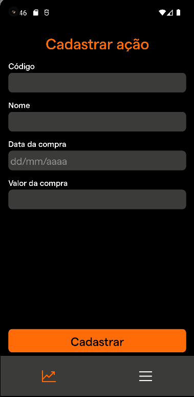
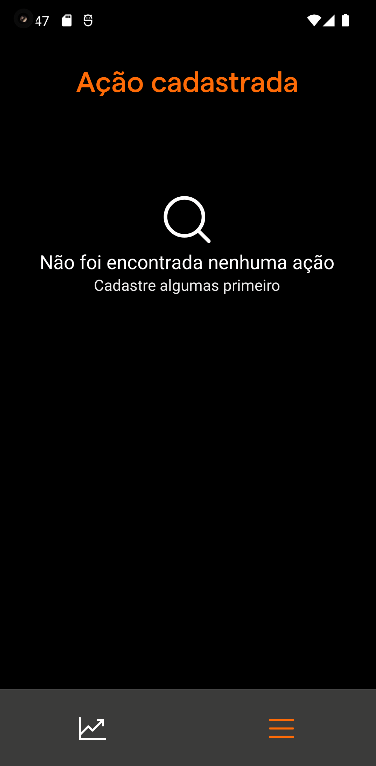
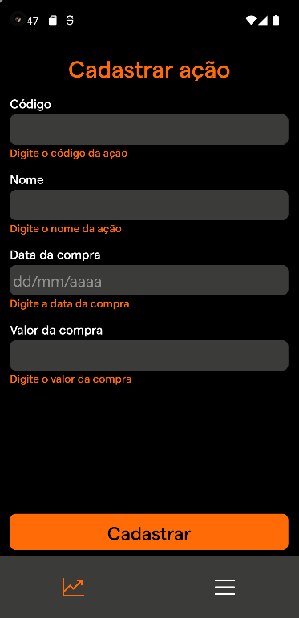
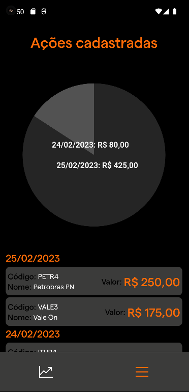

<h4 align="center">
    <h1 align="center">
      MyCapital Challenge
    </h1>
    <br><br>
</h4>

<h4 align="center">
    <br><br>
    <p align="center">
      <a href="#-about">About</a>&nbsp;&nbsp;&nbsp;|&nbsp;&nbsp;&nbsp;
      <a href="#-technologies">Technologies</a>&nbsp;&nbsp;&nbsp;|&nbsp;&nbsp;&nbsp;
      <a href="#-how-to-run-the-project">Run</a>&nbsp;&nbsp;&nbsp;|&nbsp;&nbsp;&nbsp;
      <a href="#-info">Info</a>&nbsp;&nbsp;&nbsp;|&nbsp;&nbsp;&nbsp;
      <a href="#-changelog">Changelog</a>&nbsp;&nbsp;&nbsp;|&nbsp;&nbsp;&nbsp;
      <a href="#-license">License</a>
  </p>
</h4>

<h1 align="center">
  <div style="display: flex; flex-direction: row;">
    
    
  <div>
  <div style="display: flex; flex-direction: row;">
    
    
  <div>
</h1>

## 🔖 About

Este projeto consiste em uma aplicação React Native com duas telas:

#### Cadastrar Ação:

Nessa tela o usuário pode preencher um formulário com as informações da ação, como código, nome, data de compra e valor de compra, todos os campos contém validações. Além disso, foi implementada uma validação para verificar se a data de compra é um feriado utilizando a API Brasil API.

#### Listagem de Ações Cadastradas

Nessa tela o usuário pode visualizar todas as ações cadastradas, agrupadas por data de compra. Foi adicionado um gráfico mostrando o dia x valor gasto.

Todas as ações foram salvas no AsyncStorage, um banco de dados local do React Native.

## 🚀 Technologies

- [ReactNative](https://reactnative.dev/)
- [ReactHookForm](https://react-hook-form.com/)
- [Zod](https://zod.dev/)
- [Axios](https://axios-http.com/)
- [VictoryNative](https://formidable.com/open-source/victory/docs/native/)
- [StyledComponents](https://styled-components.com/)
- [PhosphorIcons](https://phosphoricons.com/)
- [ReactNavigation](https://reactnavigation.org/)

## 🏁 How to run the project

#### Clone the repository

```bash
git clone https://github.com/rafinhaa/mycapital-challenge.git
cd mycapital-challenge
```

#### Install dependencies

```bash
yarn install
```

#### Build in iOS

```bash
cd ios && pod install && cd..
yarn run ios
```

#### Build in Android

```bash
yarn react-native start
```

## ℹ️ Info

#### Melhorias

Devido o pouco tempo disponibilizado, as seguintes melhorias foram identificadas e não priorizadas durante o desenvolvimento:

- Adicionar biblioteca para lidar com a responsividade da fonte
- Adicionar máscaras aos inputs
- Adicionar biblioteca de toast para exibir mensagens

## 📝 License

[MIT](LICENSE)

**Free Software, Hell Yeah!**
